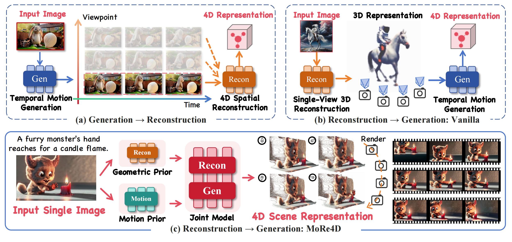
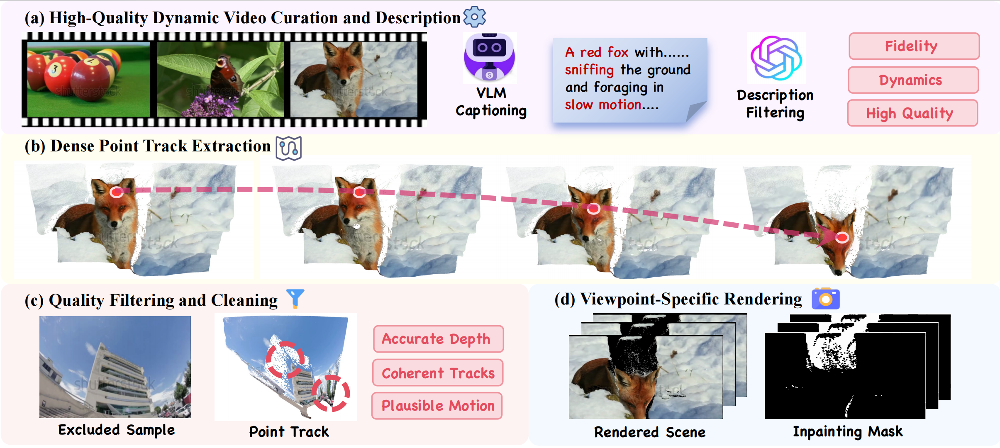
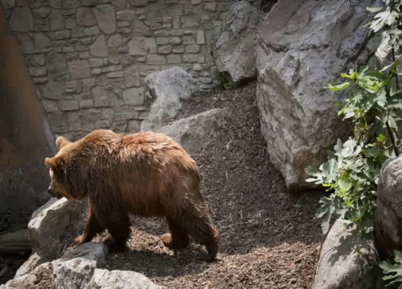
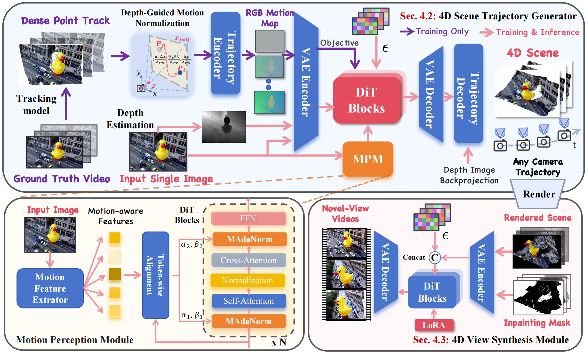
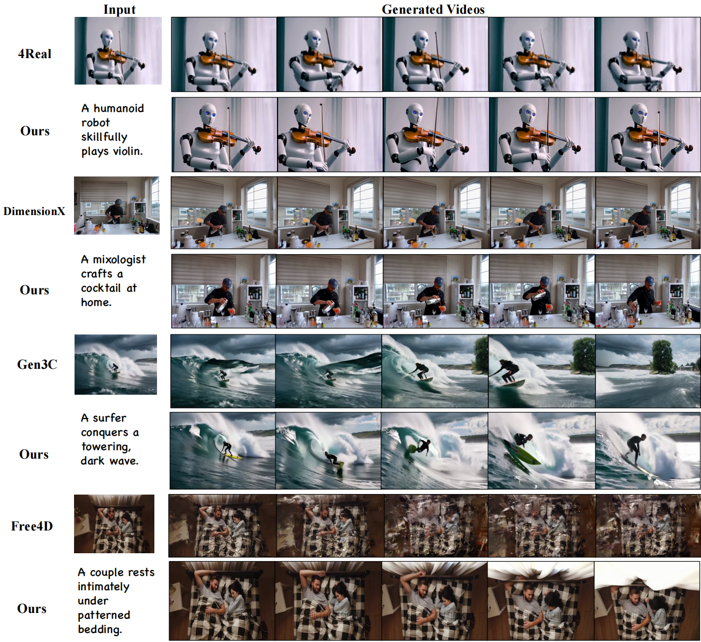

# Joint 3D Geometry Reconstruction and Motion Generation for 4D Synthesis from a Single Image

<b>[Yanran Zhang](https://github.com/Zhangyr2022/)<sup>\*,1</sup>, [Ziyi Wang](https://wangzy22.github.io/)<sup>\*,1</sup>, [Wenzhao Zheng](https://wzzheng.net/#)<sup>†,1</sup>, [Zheng Zhu](http://www.zhengzhu.net/)<sup>2</sup>, [Jie Zhou](https://scholar.google.com/citations?user=6a79aPwAAAAJ&hl=en)<sup>1</sup>, [Jiwen Lu](https://ivg.au.tsinghua.edu.cn/Jiwen_Lu/)<sup>1</sup></b>
 
<sup>1</sup>Department of Automation, Tsinghua University, China &nbsp;&nbsp;&nbsp; <sup>2</sup>GigaAI

<i><sup>*</sup>Equal Contribution &nbsp;&nbsp; <sup>†</sup>Project Leader</i>

[](https://github.com/Zhangyr2022/MoRe4D)
[](https://arxiv.org/abs/2512.05044)
[](https://ivg-yanranzhang.github.io/MoRe4D/)
[-yellow)](#trajscene-60k-dataset)

<div align="center">
  
</div>

## 📝 Abstract

**MoRe4D** generates interactive, dynamic 4D scenes from a single static image. Unlike previous paradigms that decouple generation and reconstruction (leading to geometric inconsistencies), we tightly couple geometric modeling and motion generation, achieving consistent 4D motion and geometry.

Generating interactive, dynamic 4D scenes from a single static image remains a core challenge. Most existing methods decouple geometry from motion (either generate-then-reconstruct or reconstruct-then-generate), causing spatiotemporal inconsistencies and poor generalization.

To overcome these limitations, we extend the reconstruct-then-generate framework to jointly couple **Mo**tion generation with geometric **Re**construction for **4D** Synthesis (**MoRe4D**). We introduce:

- 🗄️ **TrajScene-60K**: A large-scale dataset of 60,000 video samples with dense point trajectories
- 🎯 **4D Scene Trajectory Generator (4D-STraG)**: A diffusion-based model that jointly generates geometrically consistent and motion-plausible 4D point trajectories
- 🎬 **4D View Synthesis Module (4D-ViSM)**: Renders videos with arbitrary camera trajectories from 4D point track representations

## 🔥 News

- [x] 2025-12-05: We have submitted our paper to arXiv. 
- [x] 2025-12-06: Code release

## 🔧 Getting Started

### Installation

1. Clone the repository:
   ```bash
   git clone https://github.com/Zhangyr2022/MoRe4D.git
   cd MoRe4D
   ```
2. Create a conda environment with Python 3.10:
   ```bash
   conda create -n more4d python=3.10
   conda activate more4d
   ```

3. Install the required dependencies:
   ```bash
   # CUDA 12.4 is recommended
   conda install pytorch torchvision torchaudio pytorch-cuda=12.4 -c pytorch -c nvidia
   pip install -r requirements.txt
   ```

4. Install additional dependencies. Clone the following repositories and install them:

- UnidepthV2 following [https://github.com/lpiccinelli-eth/UniDepth#](https://github.com/lpiccinelli-eth/UniDepth#)
- Gaussian Splatting following [https://github.com/slothfulxtx/diff-gaussian-rasterization](https://github.com/graphdeco-inria/diff-gaussian-rasterization/tree/8064f52ca233942bdec2d1a1451c026deedd320b)


## 📊 TrajScene-60K Dataset

<div align="center">
  
</div>

To address the data scarcity for 4D generation, we present **TrajScene-60K**, a large-scale dataset containing:

- 📹 **60,000 High-Quality Samples**: Curated from WebVid-10M using VLM-based filtering (CogVLM2 & DeepSeek-V3)
- 🎯 **Dense Annotations**: Includes dense 4D point trajectories, per-frame depth maps, and occlusion masks
- 📝 **Rich Semantics**: Paired with high-quality captions describing both scene content and dynamic behavior

**Dataset will be released soon!**


### Usage

Prepare your input data in the required format.

#### Training Motion-Senesitive VAE

Please download [Wan2.1-Fun-V1.1-14B-Control](https://huggingface.co/alibaba-pai/Wan2.1-Fun-V1.1-14B-Control) checkpoint first, and put it into `./models` folder.

```bash
bash scripts/4D_STraG_training/train_vae.sh
```

#### Training 4D-STraG(Scene Trajectory Generator)

4D-STraG is a joint diffusion model that simultaneously reconstructs and generates spatiotemporal point trajectories. Key innovations:
- **Depth-Guided Motion Normalization**: Ensures scale invariance
- **Motion Perception Module (MPM)**: Injects rich motion priors from the input image

In addition to downloading the [Wan2.1-Fun-V1.1-14B-Control](https://huggingface.co/alibaba-pai/Wan2.1-Fun-V1.1-14B-Control) checkpoint, you also need to download the [OmniMAE](https://dl.fbaipublicfiles.com/omnivore/omnimae_ckpts/vitb_pretrain.torch) and [UniDepth](https://huggingface.co/lpiccinelli/unidepth-v2-vitl14) checkpoints, then place them in the `./models` folder.


```bash
bash scripts/4D_STraG_training/train_wan.sh
```

#### Training 4D-ViSM(View Synthesis Module)

4D-ViSM Leverages the dense 4D point cloud representation to synthesize high-fidelity novel view videos, filling in dis-occluded regions coherently using generative priors.

Please download [Wan2.1-Fun-V1.1-14B-InP](https://huggingface.co/alibaba-pai/Wan2.1-Fun-V1.1-14B-InP) checkpoint first, and put it into `./models` folder. 

```bash
bash scripts/4D_ViSM_training/train.sh
```

#### Memory Optimization

If you encounter OOM (Out of Memory) issues, enable DeepSpeed by modifying the accelerate launch line in the scripts:

DeepSpeed Zero-2: Add `accelerate launch --use_deepspeed --deepspeed_config_file config/zero_stage2_config.json --deepspeed_multinode_launcher standard /path/to/script`

DeepSpeed Zero-3 (Max Savings): Add `accelerate launch --zero_stage 3 --zero3_save_16bit_model true --zero3_init_flag true --use_deepspeed --deepspeed_config_file config/zero_stage3_config.json --deepspeed_multinode_launcher standard /path/to/script`

#### Inference

After training, you can generate 4D scenes using the **inference** script:

```bash
# Inference for whole pipeline
bash infer.sh
# Inference for VAE
bash infer_vae.sh
```

## 🎨 Results Showcase

### Generated Samples

<table>
<tr>
<td width="33%" align="center"><b>Input</b></td>
<td width="33%" align="center"><b>4D Point Tracking (4D-STraG)</b></td>
<td width="33%" align="center"><b>Multi-View Videos (4D-ViSM)</b></td>
</tr>

<tr>
<td colspan="3"><i>A brown bear walks across rocky terrain.</i></td>
</tr>
<tr>
<td align="center"></td>
<td align="center"><video src="https://github.com/user-attachments/assets/21c0acd3-4ef9-46a5-85af-a0d0fd51bfb4" width="100%"  muted></video></td>
<td align="center"><video src="https://github.com/user-attachments/assets/8c4ec888-4284-432b-90d8-d1937af2f7a3" width="100%"  muted></video></td>
</tr>

<tr>
<td colspan="3"><i>A camel walks along a path in a sunny zoo enclosure.</i></td>
</tr>
<tr>
<td align="center"></td>
<td align="center"><video src="https://github.com/user-attachments/assets/59d1b3db-a933-44d7-a89d-1e990ba5f6c7" width="100%"  muted></video></td>
<td align="center"><video src="https://github.com/user-attachments/assets/3618d7e5-cfdc-49ba-9520-80c06637e10c" width="100%"   muted></video></td>
</tr>

</table>

## 💡 Methodology

<div align="center">
  
</div>

*Figure: Overview of the MoRe4D framework for unified 4D synthesis.*

Our framework consists of two core components designed to ensure both geometric stability and dynamic realism.

<!-- ### 🎯 4D Scene Trajectory Generator (4D-STraG)
A joint diffusion model that simultaneously reconstructs and generates spatiotemporal point trajectories. Key innovations:
- **Depth-Guided Motion Normalization**: Ensures scale invariance
- **Motion Perception Module (MPM)**: Injects rich motion priors from the input image -->

<!-- ### 🎬 4D View Synthesis Module (4D-ViSM)
Leverages the dense 4D point cloud representation to synthesize high-fidelity novel view videos, filling in dis-occluded regions coherently using generative priors. -->

<!-- 
## 🎯 Qualitative Comparisons

### Multi-View & Trajectory Generation

<div align="center">
  
</div>

*Our model generates consistent 4D point clouds (Top) and renders high-quality videos under arbitrary camera trajectories (Bottom).*

### Comparison with State-of-the-Art Methods

<div align="center">
  
</div>

*Visual comparison with 4Real, DimensionX, Gen3C, and Free4D. MoRe4D produces more diverse motion and preserves structural consistency better than decoupled approaches.* -->

## 🙏 Acknowledgments

We extend our sincere gratitude to the following open-source projects for their valuable resources and foundational support:

- [Wan2.1](https://github.com/Wan-Video/Wan2.1)
- [Omnivore](https://github.com/facebookresearch/omnivore)
- [VideoX-Fun](https://github.com/aigc-apps/VideoX-Fun)

We are also thankful to the broader open-source community for their continuous contributions and support.

## 📖 Citation

If you find our work useful for your research, please consider citing us:

```bibtex
@article{zhang2025more4d,
  title={Joint 3D Geometry Reconstruction and Motion Generation for 4D Synthesis from a Single Image},
  author={Zhang, Yanran and Wang, Ziyi and Zheng, Wenzhao and Zhu, Zheng and Zhou, Jie and Lu, Jiwen},
  archivePrefix={arXiv},
  primaryClass={cs.CV},
  url={https://arxiv.org/abs/2512.05044}, 
}
```

## 📧 Contact

For questions and discussions, please open an issue or contact:
- Yanran Zhang: [GitHub](https://github.com/Zhangyr2022/)
- Ziyi Wang: [Homepage](https://wangzy22.github.io/)

